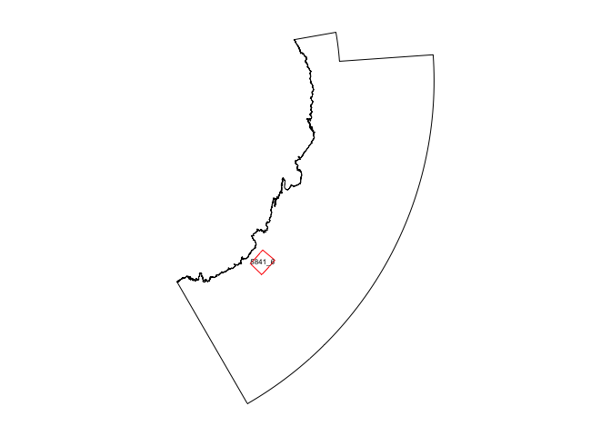

<!-- README.md is generated from README.Rmd. Please edit that file -->
CCAMLRGIS
=========

A package for reading spatial data that is displayed on the CCAMLR online GIS directly from the webpoint end service into R and creating spatial data for plotting and analyses in R or for exporting and displaying on the online GIS

Installation
------------

You can install CCAMLRGIS from github with:

``` r
# install.packages("devtools")
devtools::install_github("lucymerobinson/TestCCAMLRGIS")
```

Example
-------

### Prepare a simple map of a proposed Research Block with a CCAMLR Subarea of interest

#### Load CCAMLRGIS library and create a proposed Research block

``` r
library(CCAMLRGIS)
# Create research block polygon 

# specify the name of the Research block
Name <-"5841_6"
# specify the Longitude coordinates in decimal degrees
Lons <- c(130, 130, 134, 134)
# sepcify the Latitude coordinates in decimal degrees
Lats <- c(-64.0, -65.5, -65.5,-64.0)
# bind information together into a dataframe for input into the create_Polys function see ?create_Polys 
Coords <- data.frame(Name=rep(Name,length(Lons)),Lats=Lats,Lons=Lons)

# create polygon of proposed Research area
New_RBs <-create_Polys(Coords)
#> Warning in `[<-`(`*tmp*`, i, value = <S4 object of class
#> structure("Polygons", package = "sp")>): implicit list embedding of S4
#> objects is deprecated
```

#### Load ASD data and index Subarea and/or Division of interest

``` r
# load ASDs from the online GIS - you will need to be online for this to work see ?load_ASDs 

ASDs <- load_ASDs("GEOJSON")

# index ASD in the area of interest - e.g. 58.4.1
ASD_5841 <- ASDs[ASDs$GAR_Short_Label%in%"5841",]
```

#### Generate map plot

``` r
par(mar=c(1,1,1,1))
raster::plot(ASD_5841)
raster::plot(New_RBs,add=TRUE,border="red")
text(sp::coordinates(New_RBs), labels=as.character(New_RBs$name),cex=0.5,col="black")
```


